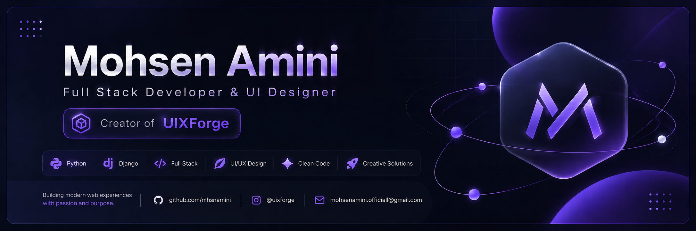

  

<h1 align="center">
  
</h1>

<!-- ⚡ نمودار بازدید اختصاصی و فوق‌سریع -->

  

  

## 👑 About Me

<table align="center" border="0">
  <tr>
    <td align="center" width="150">
      
    </td>
    <td>
      
🧠 <strong>Full Stack Developer</strong> & UI Designer

      
💻 <strong>Python</strong> · Django · JavaScript

      
🎨 Figma · Motion Design · UI Systems

      
🚀 Building <strong>UIXForge</strong> — premium UI components

    </td>
  </tr>
</table>

> *Turning coffee into elegant code since 2020 ☕*

## 🎯 Current Focus

  
  
  
  

## ⚜️ Tech Stack

  

## 💎 Featured Project

  

  
<b>🔮 What's inside UIXForge?</b>

   
  

    ✅ Auth Components &nbsp;|&nbsp;
    ✅ Dashboard Interfaces &nbsp;|&nbsp;
    ✅ Landing Pages 
    ✅ Forms & Inputs &nbsp;|&nbsp;
    ✅ UI Patterns &nbsp;|&nbsp;
    ✅ Interactive Experiences
  

## 🏗️ What I Build

  
  
  
  
  
  
  
  

## 📊 GitHub Dashboard

<!-- آمار کلی + زبان‌ها -->

  
  

<!-- استریک -->

  

<!-- نمودار فعالیت -->

  

<!-- تروفی‌ها -->

  

## 🐍 Contribution Snake

  <picture>
    <source media="(prefers-color-scheme: dark)" srcset="https://raw.githubusercontent.com/mhsnamini/mhsnamini/output/github-contribution-grid-snake-dark.svg">
    <source media="(prefers-color-scheme: light)" srcset="https://raw.githubusercontent.com/mhsnamini/mhsnamini/output/github-contribution-grid-snake.svg">
    
  </picture>

## 🌌 Philosophy

  

## 📬 Let's Connect

  
  
  

 

  

  ⚡ <strong>UIXForge</strong> — Crafting premium user experiences, one component at a time.

---

✨ آخرین بروزرسانی خودکار: 2026-06-22 11:36 UTC
